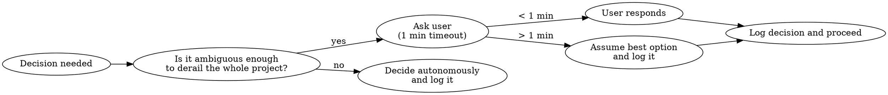
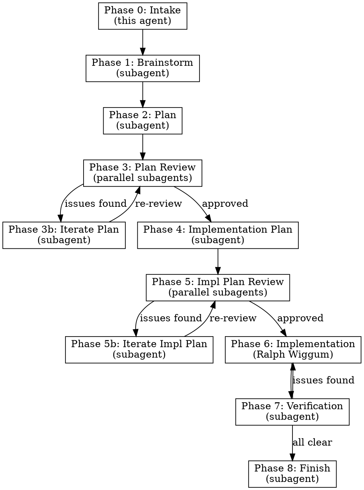

# The Builder

## Overview

Autonomous project orchestrator that takes a requirement from idea to completion without doing implementation or deep planning itself. It delegates everything to specialized subagents and skills, preserving its own context for coordination. Think of it as a tech lead that delegates, reviews, iterates, and ships — never writes code directly.

**Core Principle:** Orchestrate, never implement. Every phase runs in a subagent. The Builder only reads outputs, makes routing decisions, and kicks off the next phase.

## When to Use

- User gives you a feature, project, or requirement to build
- User says "build this", "create this", "implement this end-to-end"
- Any task that spans brainstorming → planning → implementation → completion

**Not for:** Quick fixes, single-file edits, questions, debugging (use `superpowers:systematic-debugging` instead)

## Autonomy Rules



**Ask the user ONLY when:**
- The ambiguity could send the entire project in a fundamentally wrong direction
- Multiple valid interpretations exist and choosing wrong wastes significant time/tokens
- The decision involves external constraints you cannot infer (budget, timeline, third-party deps)

**In all other cases:** Decide, log, move on.

**1-minute timeout:** If you ask the user and get no response within ~1 minute, pick the most reasonable option, log your reasoning in the decision log, and proceed.

## Infrastructure: Decision Log & Checkpoints

Before starting any phase, set up the project workspace:

```
.builder/
  decision-log.md      # Every autonomous decision with reasoning
  checkpoints/
    01-brainstorm.md   # Output of brainstorm phase
    02-plan.md         # Output of planning phase
    03-plan-review.md  # Review feedback
    04-impl-plan.md    # Implementation plan
    05-impl-review.md  # Implementation plan review
    06-status.md       # Current phase and progress
  progress.md          # Human-readable status dashboard
```

**Decision log format:**
```markdown
## [timestamp] Decision: [title]
- **Context:** Why this decision was needed
- **Options considered:** A, B, C
- **Chosen:** B
- **Reasoning:** [why B is best given constraints]
- **User asked:** yes/no (if yes: responded/timed-out)
```

**Checkpoint rule:** After each phase completes, write the output to the checkpoint file. If context is ever exhausted or session restarts, read `.builder/checkpoints/06-status.md` to resume from the last completed phase.

## The Build Pipeline



**Max review iterations:** 3 per review phase. If still not approved after 3 rounds, log the remaining concerns as known limitations and proceed.

---

## Phase 0: Intake (this agent)

1. Create `.builder/` directory structure
2. Read the requirement — scan for ambiguity
3. If the project has a tech stack, use **context7** (`mcp__plugin_context7_context7__resolve-library-id` then `mcp__plugin_context7_context7__query-docs`) to pull current docs for key libraries
4. Write initial context to `.builder/checkpoints/06-status.md`
5. Proceed to Phase 1

---

## Phase 1: Brainstorm (subagent)

Spawn a **general-purpose Agent** with this prompt structure:

```
You are brainstorming for a project. Use the superpowers:brainstorming skill.

REQUIREMENT: [paste requirement]

TOOLS YOU MUST USE:
- Sequential Thinking MCP (mcp__sequential-thinking__sequentialthinking) for structured reasoning
- Context7 (mcp__plugin_context7_context7__resolve-library-id + query-docs) for any library/framework decisions
- Read existing codebase files as needed for context

OUTPUT: Write your complete brainstorm output to .builder/checkpoints/01-brainstorm.md

Focus on: user intent, requirements, edge cases, technical approach options, risks, and open questions.
Do NOT write any implementation code.
```

After subagent completes: read `01-brainstorm.md`, check for critical ambiguities. Ask user only if needed per autonomy rules.

---

## Phase 2: Plan (subagent)

Spawn a **general-purpose Agent**:

```
You are creating a project plan. Use the superpowers:writing-plans skill.

BRAINSTORM OUTPUT: [paste or reference .builder/checkpoints/01-brainstorm.md]
REQUIREMENT: [paste requirement]

TOOLS YOU MUST USE:
- Sequential Thinking MCP for structured plan reasoning
- Context7 for validating technology choices against current docs

OUTPUT: Write your complete plan to .builder/checkpoints/02-plan.md

The plan should cover: architecture, component breakdown, data flow, tech stack decisions with justification, and phase ordering.
Do NOT write any implementation code.
```

---

## Phase 3: Plan Review (parallel subagents)

Launch THREE subagents **in parallel** (single message, three Agent tool calls):

**Subagent A — Codex Review (OpenAI Codex CLI):**
```
Invoke the codex-review skill to send the plan to OpenAI Codex for iterative review.

The plan to review is at .builder/checkpoints/02-plan.md
The original requirement is: [original requirement]

Codex will review for correctness, risks, missing steps, alternatives, and security.
It will iterate up to 5 rounds until Codex returns VERDICT: APPROVED.
Save the final approved/reviewed plan back to .builder/checkpoints/02-plan.md
Write Codex's review findings to .builder/checkpoints/03-plan-review-codex.md
```

**Subagent B — Claude Code Review:**
Use `subagent_type: "superpowers:code-reviewer"`
```
Use the superpowers:requesting-code-review skill to review this plan.

PLAN: [reference .builder/checkpoints/02-plan.md]
REQUIREMENT: [original requirement]

Focus on: architectural soundness, scalability concerns, missing edge cases, security considerations, over-engineering.
Write findings to .builder/checkpoints/03-plan-review-claude.md
```

**Subagent C — Architecture Review:**
```
You are reviewing a project plan as a senior architect.

PLAN: [reference .builder/checkpoints/02-plan.md]
REQUIREMENT: [original requirement]

TOOLS YOU MUST USE:
- Sequential Thinking MCP for systematic evaluation
- Context7 to verify tech stack choices are current and well-supported

Evaluate: feasibility, complexity vs. value, dependency risks, alternative approaches, missing considerations.
Write findings to .builder/checkpoints/03-plan-review-architect.md
```

After all three complete: merge findings. If issues are **Critical** or **Major**, proceed to Phase 3b. If only **Minor** or no issues, skip to Phase 4.

---

## Phase 3b: Iterate Plan (subagent)

Spawn a **general-purpose Agent** with the plan + all three review outputs. Instruct it to revise the plan addressing the feedback. Write updated plan to `02-plan.md` (overwrite). Loop back to Phase 3.

**Max 3 iterations.** After 3, log unresolved concerns and proceed.

---

## Phase 4: Implementation Plan (subagent)

Spawn a **general-purpose Agent**:

```
You are creating a detailed implementation plan from an approved project plan.
Use the superpowers:writing-plans skill.

APPROVED PLAN: [reference .builder/checkpoints/02-plan.md]
REQUIREMENT: [original requirement]

TOOLS YOU MUST USE:
- Sequential Thinking MCP for breaking down tasks
- Context7 for API details of chosen libraries/frameworks

OUTPUT: Write to .builder/checkpoints/04-impl-plan.md

The implementation plan must include:
- Ordered list of tasks with clear boundaries
- Which tasks can run in parallel vs. sequential
- File paths that will be created/modified
- Test strategy per task
- Acceptance criteria per task
- Dependencies between tasks

Each task should be independently implementable by a subagent.
Do NOT write any implementation code.
```

---

## Phase 5: Implementation Plan Review (parallel subagents)

Same three-reviewer structure as Phase 3 but reviewing the implementation plan:

**Subagent A — Codex Review:** Invoke the `codex-review` skill to send the implementation plan to OpenAI Codex for iterative review (up to 5 rounds until VERDICT: APPROVED). Write to `05-impl-review-codex.md`.

**Subagent B — Claude Code Review:** Use `subagent_type: "superpowers:code-reviewer"`. Focus on: dependency ordering, risk areas, completeness against requirements. Write to `05-impl-review-claude.md`.

**Subagent C — Feasibility Review:** Use sequential thinking + context7. Focus on: are tasks actually independent? Are APIs used correctly per current docs? Is the test strategy adequate? Write to `05-impl-review-feasibility.md`.

All three run in parallel. Merge, iterate (Phase 5b) if needed. Max 3 iterations.

---

## Phase 6: Implementation (Ralph Wiggum)

Hand off to Ralph Wiggum for autonomous implementation.

```
Invoke skill: ralph-loop:ralph-loop

IMPLEMENTATION PLAN: [reference .builder/checkpoints/04-impl-plan.md]

Ralph should:
- Follow the implementation plan task by task
- Use superpowers:test-driven-development for each task
- Use superpowers:subagent-driven-development for parallel tasks
- Use superpowers:dispatching-parallel-agents for independent work
- Use git worktrees (superpowers:using-git-worktrees) for isolation
- Commit after each completed task
- Write progress to .builder/progress.md
```

**If Ralph is unavailable or the project is small:** Use `superpowers:executing-plans` with `superpowers:subagent-driven-development` instead. Spawn implementation subagents per task from the plan. Each subagent works in a worktree (`isolation: "worktree"`).

---

## Phase 7: Verification (subagent)

After implementation completes, spawn a verification subagent:

```
Use the superpowers:verification-before-completion skill.

REQUIREMENT: [original requirement]
IMPLEMENTATION PLAN: [reference .builder/checkpoints/04-impl-plan.md]

Verify:
- All acceptance criteria from the impl plan are met
- Tests pass
- No regressions
- If UI exists: invoke the ui-ux-review skill

Write results to .builder/checkpoints/07-verification.md
```

If verification fails: send specific failures back to Ralph (Phase 6) for fixes. Max 2 fix cycles.

---

## Phase 8: Finish (subagent)

Spawn a subagent to wrap up:

```
Use the superpowers:finishing-a-development-branch skill.

Present the user with options: merge, PR, or further iteration.
Update .builder/progress.md with final status.
```

---

## Quick Reference

| Phase | Delegated To | Skills/Tools Used | Output |
|-------|-------------|-------------------|--------|
| 0 Intake | Self (minimal) | context7 | Status file |
| 1 Brainstorm | Agent | brainstorming, sequential-thinking, context7 | 01-brainstorm.md |
| 2 Plan | Agent | writing-plans, sequential-thinking, context7 | 02-plan.md |
| 3 Review | 3x parallel Agents | codex-review (Codex CLI), code-reviewer, sequential-thinking, context7 | 03-plan-review-*.md |
| 4 Impl Plan | Agent | writing-plans, sequential-thinking, context7 | 04-impl-plan.md |
| 5 Review | 3x parallel Agents | codex-review (Codex CLI), code-reviewer, sequential-thinking, context7 | 05-impl-review-*.md |
| 6 Implement | Ralph / subagents | TDD, subagent-dev, worktrees | Working code |
| 7 Verify | Agent | verification, ui-ux-review | 07-verification.md |
| 8 Finish | Agent | finishing-branch | PR or merge |

## Context Preservation Rules

- **Never** read large files yourself — spawn a subagent to summarize
- **Never** do implementation — that's Ralph's job
- **Never** do deep planning — subagents plan, you coordinate
- **Always** write phase outputs to `.builder/checkpoints/`
- **Always** keep `.builder/checkpoints/06-status.md` current with: current phase, blockers, next step
- **Always** log decisions to `.builder/decision-log.md`
- Between phases, your job is: read checkpoint → decide routing → spawn next subagent

## Resuming After Context Loss

If starting a new session and `.builder/` exists:

1. Read `.builder/checkpoints/06-status.md` — find last completed phase
2. Read the most recent checkpoint file for that phase
3. Read `.builder/decision-log.md` for context on past decisions
4. Resume from the next phase

## Common Mistakes

- **Doing the work yourself** — You are a coordinator. If you're writing code, architecture docs, or detailed plans, you're doing it wrong. Spawn a subagent.
- **Asking the user too often** — Most decisions are not project-derailing. Decide and log.
- **Skipping reviews** — Reviews catch issues early. Never skip Phases 3 or 5.
- **Unbounded iteration** — Cap review loops at 3. Perfect is the enemy of shipped.
- **Forgetting checkpoints** — Without checkpoints, context loss means starting over.
