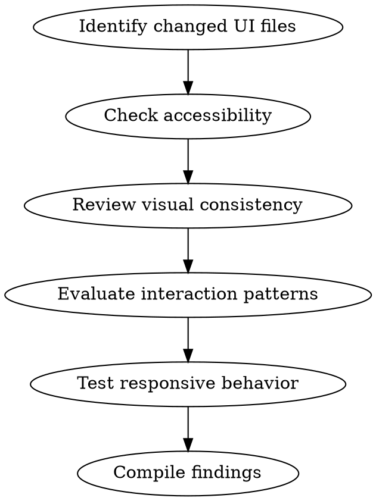

# UI/UX Review

## Overview

Structured review of UI implementations against usability heuristics, accessibility standards, and visual consistency. Catches issues that functional tests miss — confusing flows, inaccessible elements, inconsistent spacing, and broken responsive layouts.

## When to Use

- After implementing or modifying UI components/screens
- Before merging PRs that touch frontend code
- When user reports "something feels off" about the UI
- When reviewing design system compliance

**Not for:** Backend-only changes, API design, data modeling

## Review Process



## Review Checklist

### 1. Accessibility (WCAG 2.1 AA)

| Check | What to look for |
|-------|-----------------|
| Semantic HTML | Correct use of `<button>`, `<nav>`, `<main>`, headings hierarchy |
| ARIA labels | Interactive elements have accessible names; decorative images use `aria-hidden` |
| Color contrast | Text meets 4.5:1 ratio (3:1 for large text); don't rely on color alone |
| Keyboard navigation | All interactive elements focusable and operable; visible focus indicators |
| Screen reader flow | Logical reading order; live regions for dynamic content |
| Form labels | Every input has an associated `<label>` or `aria-label` |
| Touch targets | Minimum 44x44px for mobile tap targets |

### 2. Visual Consistency

| Check | What to look for |
|-------|-----------------|
| Spacing | Consistent use of spacing scale (4px/8px grid or design tokens) |
| Typography | Correct font sizes, weights, line heights from the type scale |
| Colors | Only design system colors; no hardcoded hex outside tokens |
| Component reuse | Using existing components vs. one-off implementations |
| Alignment | Elements properly aligned within their containers |
| Icons | Consistent icon set, sizing, and stroke weight |

### 3. Interaction & Usability

| Check | What to look for |
|-------|-----------------|
| Loading states | Skeleton screens or spinners for async operations |
| Empty states | Helpful messaging when no data exists |
| Error states | Clear, actionable error messages near the relevant field |
| Hover/active/disabled | All interactive states visually distinct |
| Feedback | User actions produce visible confirmation (toast, state change) |
| Destructive actions | Confirmation dialogs for irreversible operations |
| Form validation | Inline validation with clear error placement |

### 4. Responsive & Layout

| Check | What to look for |
|-------|-----------------|
| Breakpoints | Layout adapts correctly at standard breakpoints |
| Content overflow | Text truncation/wrapping handled; no horizontal scroll |
| Image scaling | Images responsive with correct aspect ratios |
| Navigation | Mobile nav pattern appropriate (hamburger, tab bar, etc.) |
| Touch vs. click | Hover-dependent interactions have touch alternatives |

## Severity Levels

- **Critical**: Blocks users or violates accessibility law (missing labels, broken keyboard nav, non-functional on mobile)
- **Major**: Degrades experience significantly (inconsistent patterns, missing error states, poor contrast)
- **Minor**: Polish issues (spacing inconsistency, alignment off by a few pixels, missing hover state)

## Output Format

Structure findings as:

```
## UI/UX Review: [component/screen name]

### Critical
- [file:line] Issue description → Suggested fix

### Major
- [file:line] Issue description → Suggested fix

### Minor
- [file:line] Issue description → Suggested fix

### What's Working Well
- Positive observations (reinforce good patterns)
```

## Common Mistakes

- **Reviewing only happy path** — Always check error, empty, and loading states
- **Ignoring keyboard users** — Tab through the entire flow before approving
- **Skipping dark mode** — If supported, verify contrast and colors in both themes
- **Missing touch targets** — Desktop-first reviews miss mobile usability issues
- **Hardcoded strings** — Check that user-facing text is externalized for i18n if applicable
